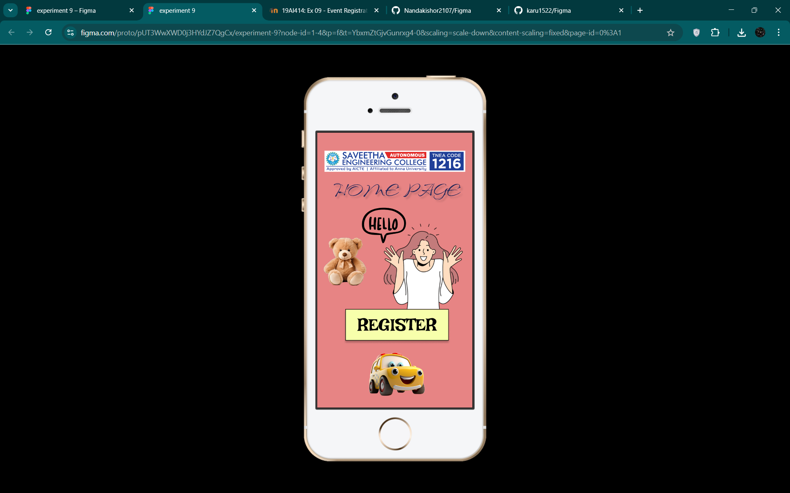
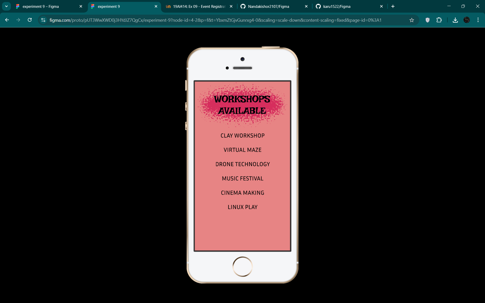
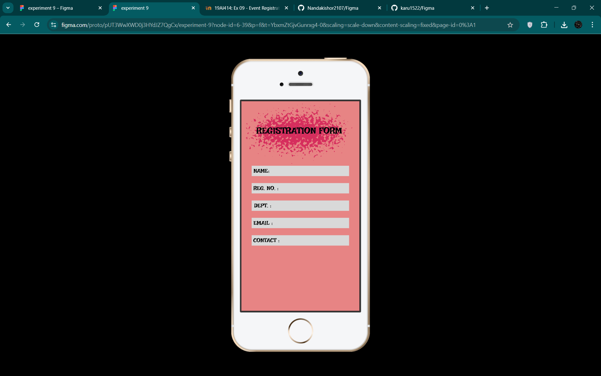
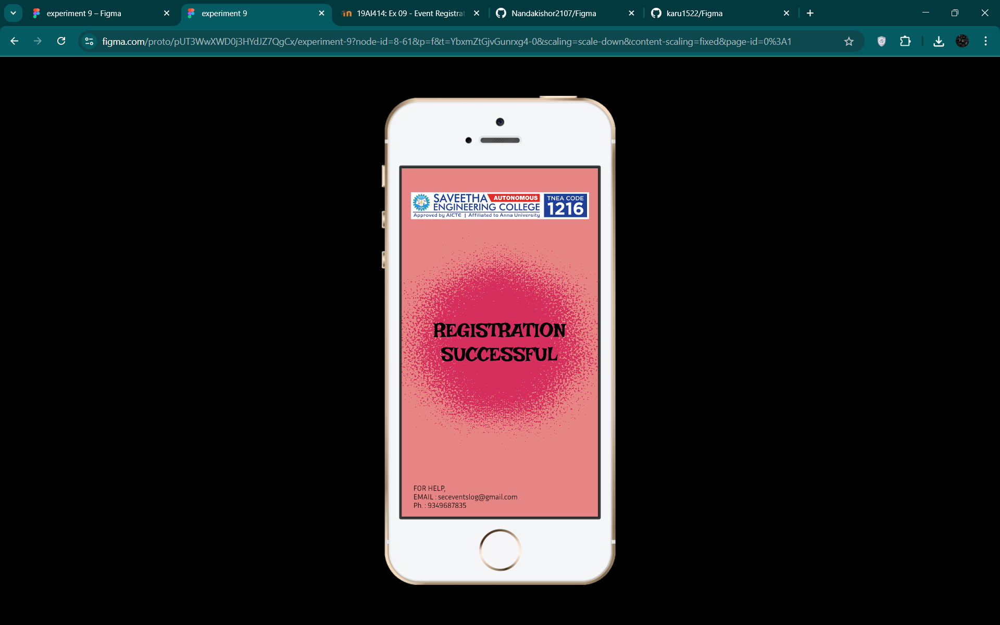

# Ex09 Event Registration Web Application
## Date:14-05-2025

## AIM:
To design, develop and deploy a web application for event registration.

## DESIGN STEPS:

### Step 1:
Create a new frame.

### Step 2:
Select any one preset size of your choice.

### Step 3:
Select the shapes you need.

### Step 4:
Import images as needed.

### Step 5:
Create pages based on your need and link them.

### Step 6:

Validate the HTML and CSS code.

### Step 6:

Publish the website in the given URL.

## DESIGN TOOL:
Figma

## CODE:
```
homepage
<div class="container--0-">
  <svg
    width="221"
    height="73"
    viewBox="0 0 221 73"
    fill="none"
    xmlns="http://www.w3.org/2000/svg"
  >
    <g filter="url(#filter0_d_1_7)">
      <rect x="4" width="213" height="65" fill="#F7FFAB"></rect>
      <rect x="4.5" y="0.5" width="212" height="64" stroke="black"></rect>
    </g>
    <defs>
      <filter
        id="filter0_d_1_7"
        x="0"
        y="0"
        width="221"
        height="73"
        filterUnits="userSpaceOnUse"
        color-interpolation-filters="sRGB"
      >
        <feFlood flood-opacity="0" result="BackgroundImageFix"></feFlood>
        <feColorMatrix
          in="SourceAlpha"
          type="matrix"
          values="0 0 0 0 0 0 0 0 0 0 0 0 0 0 0 0 0 0 127 0"
          result="hardAlpha"
        ></feColorMatrix>
        <feOffset dy="4"></feOffset>
        <feGaussianBlur stdDeviation="2"></feGaussianBlur>
        <feComposite in2="hardAlpha" operator="out"></feComposite>
        <feColorMatrix
          type="matrix"
          values="0 0 0 0 0 0 0 0 0 0 0 0 0 0 0 0 0 0 0.25 0"
        ></feColorMatrix>
        <feBlend
          mode="normal"
          in2="BackgroundImageFix"
          result="effect1_dropShadow_1_7"
        ></feBlend>
        <feBlend
          mode="normal"
          in="SourceGraphic"
          in2="effect1_dropShadow_1_7"
          result="shape"
        ></feBlend>
      </filter>
    </defs>
  </svg>
  <div class="text-0-1-2">REGISTER</div>
  
  <div class="text-0-1-7">HOME PAGE</div>
</div>

page2
<div class="container--0-">
  <div class="text-0-1-0">WORKSHOPS<br />AVAILABLE</div>
  <svg
    width="320"
    height="174"
    viewBox="0 0 320 174"
    fill="none"
    xmlns="http://www.w3.org/2000/svg"
  >
    <g style="mix-blend-mode:overlay" filter="url(#filter0_g_6_37)">
      <path
        d="M158.045 31.1778C159.011 31.0597 159.989 31.0597 160.955 31.1778L248.008 41.814C249.622 42.0112 251.179 42.5343 252.585 43.3515L288.913 64.4739C294.469 67.7043 296.494 74.7384 293.505 80.4281L284.443 97.6795C282.911 100.597 280.246 102.756 277.073 103.65L209.492 122.686C208.433 122.984 207.338 123.135 206.238 123.135H112.762C111.662 123.135 110.567 122.984 109.508 122.686L41.9267 103.65C38.7544 102.756 36.0892 100.597 34.5566 97.6795L25.495 80.4281C22.5064 74.7384 24.531 67.7043 30.0869 64.4739L66.4152 43.3515C67.8208 42.5343 69.3777 42.0112 70.9916 41.814L158.045 31.1778Z"
        fill="#232657"
      ></path>
    </g>
    <defs>
      <filter
        id="filter0_g_6_37"
        x="-26.0033"
        y="-19.0308"
        width="371.007"
        height="192.286"
        filterUnits="userSpaceOnUse"
        color-interpolation-filters="sRGB"
      >
        <feFlood flood-opacity="0" result="BackgroundImageFix"></feFlood>
        <feBlend
          mode="normal"
          in="SourceGraphic"
          in2="BackgroundImageFix"
          result="shape"
        ></feBlend>
        <feTurbulence
          type="fractalNoise"
          baseFrequency="0.20876826345920563 0.20876826345920563"
          numOctaves="3"
          seed="7125"
        ></feTurbulence>
        <feDisplacementMap
          in="shape"
          scale="100.23999786376953"
          xChannelSelector="R"
          yChannelSelector="G"
          result="displacedImage"
          width="100%"
          height="100%"
        ></feDisplacementMap>
        <feMerge result="effect1_texture_6_37">
          <feMergeNode in="displacedImage"></feMergeNode>
        </feMerge>
      </filter>
    </defs>
  </svg>
  <div class="text-0-1-2">
    CLAY WORKSHOP<br /><br />VIRTUAL MAZE<br /><br />DRONE TECHNOLOGY<br /><br />MUSIC
    FESTIVAL<br /><br />CINEMA MAKING<br /><br />LINUX PLAY
  </div>
</div>

page3
<div class="container--0-">
  <div class="text-0-1-0">REGISTRATION FORM</div>
  <svg
    width="320"
    height="189"
    viewBox="0 0 320 189"
    fill="none"
    xmlns="http://www.w3.org/2000/svg"
  >
    <g style="mix-blend-mode:overlay" filter="url(#filter0_g_6_42)">
      <path
        d="M150.721 43.4641C153.231 43.1559 155.769 43.1559 158.279 43.4641L226.254 51.8129C230.44 52.327 234.477 53.6898 238.118 55.8179L255.62 66.0476C265.995 72.1117 269.778 85.2562 264.212 95.9073V95.9073C261.346 101.392 256.348 105.455 250.394 107.141L200.197 121.355C197.449 122.133 194.607 122.527 191.751 122.527H117.249C114.393 122.527 111.551 122.133 108.803 121.355L58.6063 107.141C52.6518 105.455 47.654 101.392 44.788 95.9073V95.9073C39.2225 85.2562 43.0048 72.1117 53.38 66.0476L70.8824 55.8179C74.5234 53.6898 78.5603 52.327 82.7461 51.8129L150.721 43.4641Z"
        fill="#232657"
      ></path>
    </g>
    <defs>
      <filter
        id="filter0_g_6_42"
        x="-23.8451"
        y="-22.8371"
        width="356.69"
        height="211.434"
        filterUnits="userSpaceOnUse"
        color-interpolation-filters="sRGB"
      >
        <feFlood flood-opacity="0" result="BackgroundImageFix"></feFlood>
        <feBlend
          mode="normal"
          in="SourceGraphic"
          in2="BackgroundImageFix"
          result="shape"
        ></feBlend>
        <feTurbulence
          type="fractalNoise"
          baseFrequency="0.14771048724651337 0.14771048724651337"
          numOctaves="3"
          seed="64"
        ></feTurbulence>
        <feDisplacementMap
          in="shape"
          scale="132.13999938964844"
          xChannelSelector="R"
          yChannelSelector="G"
          result="displacedImage"
          width="100%"
          height="100%"
        ></feDisplacementMap>
        <feMerge result="effect1_texture_6_42">
          <feMergeNode in="displacedImage"></feMergeNode>
        </feMerge>
      </filter>
    </defs></svg
  ><svg
    width="264"
    height="28"
    viewBox="0 0 264 28"
    fill="none"
    xmlns="http://www.w3.org/2000/svg"
  >
    <rect width="264" height="28" fill="#D9D9D9"></rect></svg
  ><svg
    width="264"
    height="28"
    viewBox="0 0 264 28"
    fill="none"
    xmlns="http://www.w3.org/2000/svg"
  >
    <rect width="264" height="28" fill="#D9D9D9"></rect></svg
  ><svg
    width="264"
    height="28"
    viewBox="0 0 264 28"
    fill="none"
    xmlns="http://www.w3.org/2000/svg"
  >
    <rect width="264" height="28" fill="#D9D9D9"></rect></svg
  ><svg
    width="264"
    height="28"
    viewBox="0 0 264 28"
    fill="none"
    xmlns="http://www.w3.org/2000/svg"
  >
    <rect width="264" height="28" fill="#D9D9D9"></rect></svg
  ><svg
    width="264"
    height="28"
    viewBox="0 0 264 28"
    fill="none"
    xmlns="http://www.w3.org/2000/svg"
  >
    <rect width="264" height="28" fill="#D9D9D9"></rect>
  </svg>
  <div class="text-0-1-7">NAME:</div>
  <div class="text-0-1-8">REG. NO. :</div>
  <div class="text-0-1-9">DEPT. :</div>
  <div class="text-0-1-10">EMAIL :</div>
  <div class="text-0-1-11">CONTACT :</div>
</div>

page4
<div class="container--0-">
  <div class="text-0-1-0">REGISTRATION SUCCESSFUL</div>
  <svg
    width="320"
    height="449"
    viewBox="0 0 320 449"
    fill="none"
    xmlns="http://www.w3.org/2000/svg"
  >
    <g style="mix-blend-mode:overlay" filter="url(#filter0_g_8_63)">
      <path
        d="M148.782 102.849C155.595 99.7667 163.405 99.7667 170.218 102.849L257.793 142.472C265.085 145.771 270.452 152.245 272.341 160.022L293.351 246.505C295.315 254.589 293.292 263.126 287.908 269.468L228.248 339.753C223.308 345.573 216.06 348.928 208.426 348.928H110.574C102.94 348.928 95.6917 345.573 90.7517 339.753L31.0919 269.468C25.7081 263.126 23.6847 254.589 25.6487 246.505L46.6589 160.022C48.5484 152.245 53.9145 145.771 61.2065 142.472L148.782 102.849Z"
        fill="#232657"
      ></path>
    </g>
    <defs>
      <filter
        id="filter0_g_8_63"
        x="-75.0864"
        y="0.537323"
        width="469.173"
        height="448.391"
        filterUnits="userSpaceOnUse"
        color-interpolation-filters="sRGB"
      >
        <feFlood flood-opacity="0" result="BackgroundImageFix"></feFlood>
        <feBlend
          mode="normal"
          in="SourceGraphic"
          in2="BackgroundImageFix"
          result="shape"
        ></feBlend>
        <feTurbulence
          type="fractalNoise"
          baseFrequency="0.33783784508705139 0.33783784508705139"
          numOctaves="3"
          seed="2398"
        ></feTurbulence>
        <feDisplacementMap
          in="shape"
          scale="200"
          xChannelSelector="R"
          yChannelSelector="G"
          result="displacedImage"
          width="100%"
          height="100%"
        ></feDisplacementMap>
        <feMerge result="effect1_texture_8_63">
          <feMergeNode in="displacedImage"></feMergeNode>
        </feMerge>
      </filter>
    </defs></svg
  >
  <div class="text-0-1-3">
    FOR HELP,<br />EMAIL : seceventslog@gmail.com<br />Ph. : 9349687835
  </div>
</div>
```


```
homepage
.container--0- {
  position: absolute;
  left: 0px;
  top: 0px;
  width: 320px;
  height: 568px;
  background-color: #e78484;
  justify-content: start;
  align-items: start;
}
.text-0-1-2 {
  width: 294px;
  height: 65px;
  color: #000000;
  font-size: 36px;
  font-family: Irish Grover, "Regular";
  font-weight: 400;
  text-align: center;
  vertical-align: center;
}
.text-0-1-7 {
  width: 287px;
  height: 33px;
  color: #232657;
  box-shadow: 4px 4px 4px 0 #000000;
  font-size: 48px;
  font-family: Island Moments, "Regular";
  font-weight: 400;
  text-align: center;
  vertical-align: center;
}

page2
.container--0- {
  position: absolute;
  left: 401px;
  top: 0px;
  width: 320px;
  height: 568px;
  background-color: #e78484;
  justify-content: start;
  align-items: start;
}
.text-0-1-0 {
  width: 283px;
  height: 85px;
  color: #000000;
  font-size: 32px;
  font-family: Irish Grover, "Regular";
  font-weight: 400;
  text-align: center;
  vertical-align: center;
}
.text-0-1-2 {
  width: 242px;
  height: 339px;
  color: #000000;
  font-size: 20px;
  font-family: Inria Sans, "Regular";
  font-weight: 400;
  text-align: center;
  vertical-align: center;
}

page3
.container--0- {
  position: absolute;
  left: 802px;
  top: 0px;
  width: 320px;
  height: 568px;
  background-color: #e78484;
  justify-content: start;
  align-items: start;
}
.text-0-1-0 {
  width: 270px;
  height: 30px;
  color: #000000;
  font-size: 24px;
  font-family: Irish Grover, "Regular";
  font-weight: 400;
  text-align: left;
  vertical-align: top;
}
.text-0-1-7 {
  width: 45px;
  height: 17px;
  color: #000000;
  font-size: 15px;
  font-family: Irish Grover, "Regular";
  font-weight: 400;
  text-align: left;
  vertical-align: top;
}
.text-0-1-8 {
  width: 73px;
  height: 17px;
  color: #000000;
  font-size: 15px;
  font-family: Irish Grover, "Regular";
  font-weight: 400;
  text-align: left;
  vertical-align: top;
}
.text-0-1-9 {
  width: 50px;
  height: 21px;
  color: #000000;
  font-size: 15px;
  font-family: Irish Grover, "Regular";
  font-weight: 400;
  text-align: center;
  vertical-align: center;
}
.text-0-1-10 {
  width: 72px;
  height: 21px;
  color: #000000;
  font-size: 15px;
  font-family: Irish Grover, "Regular";
  font-weight: 400;
  text-align: center;
  vertical-align: center;
}
.text-0-1-11 {
  width: 84px;
  height: 20px;
  color: #000000;
  font-size: 15px;
  font-family: Irish Grover, "Regular";
  font-weight: 400;
  text-align: center;
  vertical-align: center;
}

page4
.container--0- {
  position: absolute;
  left: 1203px;
  top: 0px;
  width: 320px;
  height: 568px;
  background-color: #e78484;
  justify-content: start;
  align-items: start;
}
.text-0-1-0 {
  width: 228px;
  height: 143px;
  color: #000000;
  font-size: 32px;
  font-family: Irish Grover, "Regular";
  font-weight: 400;
  text-align: center;
  vertical-align: center;
}
.text-0-1-3 {
  width: 214px;
  height: 61px;
  color: #000000;
  font-size: 12px;
  font-family: Inria Sans, "Light";
  font-weight: 300;
  text-align: left;
  vertical-align: top;
}
```

## OUTPUT:










## RESULT:
The program to design, develop and deploy a web application for event registration is completed successfully.
